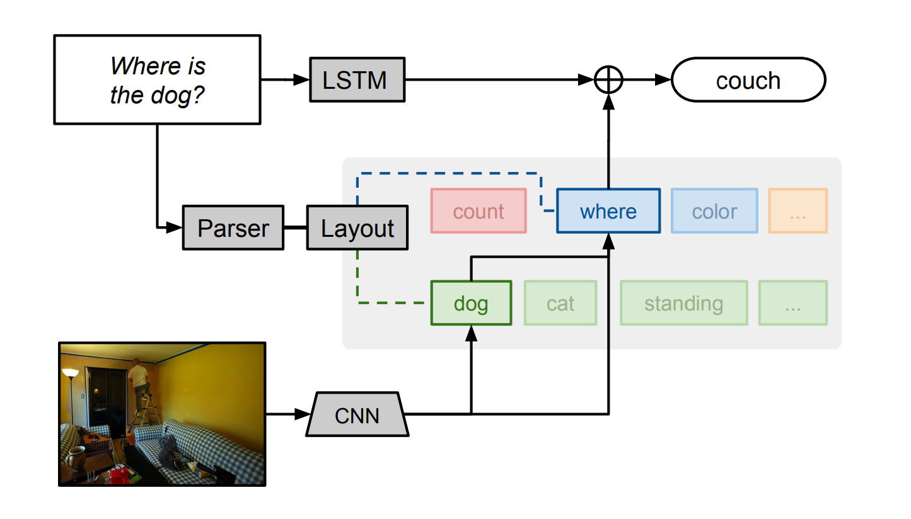
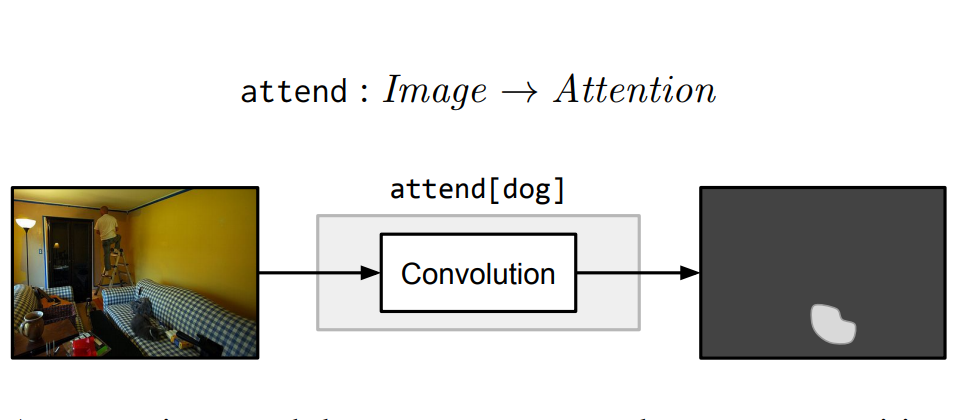
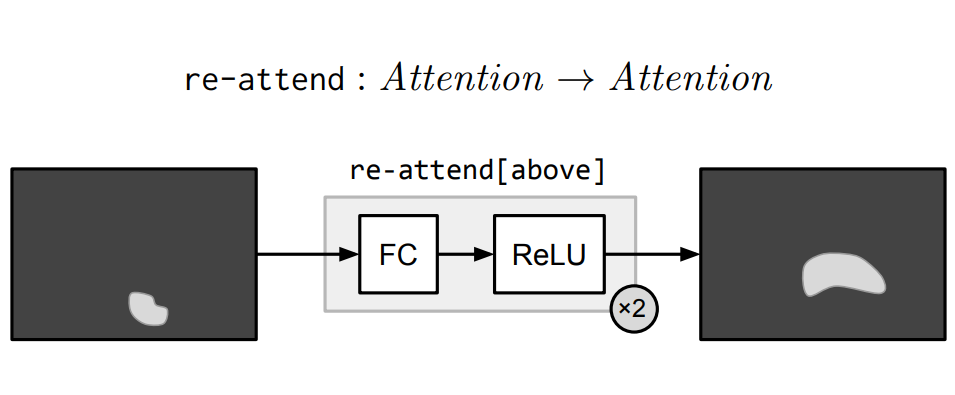
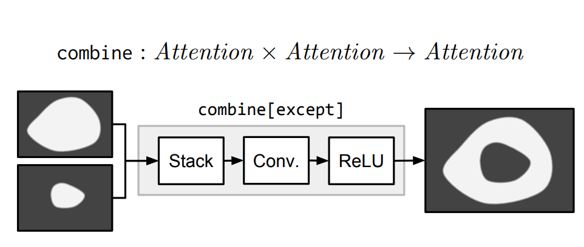
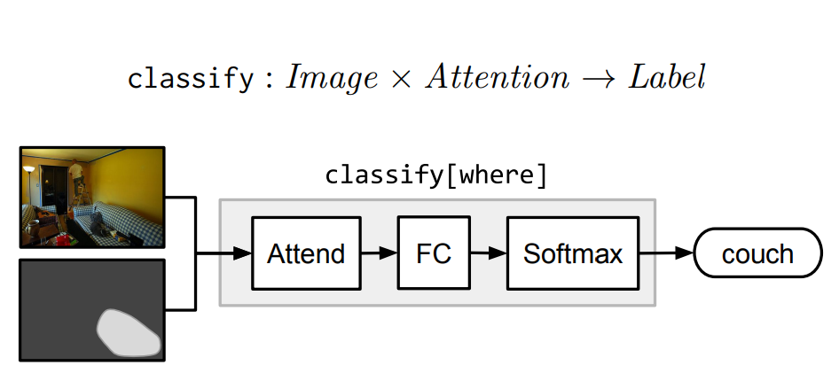
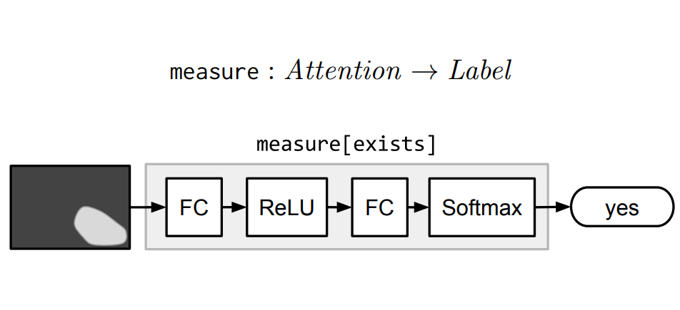

---
export_on_save:
  html: true
---

最近Follow了伯克利大学Ph.D [Jacob Andreas](https://people.eecs.berkeley.edu/~jda/) 对于VQA任务的两篇论文：

 - [Neural Module Network](http://arxiv.org/abs/1511.02799)
 - [Learning to compose Neural Networks for Question Answering](http://arxiv.org/abs/1601.01705)

并根据阅读其发布在[github](https://github.com/jacobandreas/nmn2)上的代码复现论文中的实验。本文为总结。

# 背景
Visual question answering[(VQA)](http://visualqa.org/)是一个新的数据集，该数据集包含图片及关于图片的一些非定式的问题。这些问题需要计算机结合常识及视觉，语言的理解作出回答。而本文开头介绍的两篇论文介绍是Jacob Andreas提出的对VQA任务所提出的新型模型Neural Module Network（NMN）。后者在前者的基础上作出了改进。

# Neural Module Network
该论文中提出的NMN的一大特点就是其结构是它并不是像传统的神经网络模型一样是一个整体，它是由多个模块化网络组合而成。根据VQA数据集中每个questions定制一个网络模型。也就是说NMN模型的网络是根据question的语言结构动态生成的。



如图，作者首先使用自然语言解析器解析每个问题，然后以此分析出回答问题所需要的基础组成单元（attention， classification 等）以及组成单元之间的联系。比如上图，我们首先产生一个对狗的attention，将其输出到位置描述器。根据底层结构，模块间传递的这些消息可能是原始图像特征、attention或分类决策；每个模块从特定输入映射到输出类型。作者在图中用不用的颜色表示不同的模块，用绿色表示attetion-producing模块(like dog)，用蓝色表示标签模块(like where)。需要注意的是，所有NMN中的模块都是独立的，可组合的，这使得NMN可以对每个问题实例组合成不用的网络，即使测试中出现的结构，在训练过程中并不曾出现过，NMN也能work。除NMN以外，作者还添加了LSTM模块去读取question，用来学习常识性的知识。

每个训练的数据项被想象成一个三元组(w,x,y):
- w 是自然语言问题
- x 是图像
- y 是答案

每个模块由一个模块集{m}完全指定，其相关参数为$\theta_m$。*P* 表示网络布局预测器，它将字符串映射成网络。给定(w,x)，通过P(w)实例化一个网络。并使用x（和w）作为输入，得到一个标签的分布。所以预测分布可以表示为$p(y|w, x; \theta)$。
## 模块

作者的目标是确定一个模块集合，这些模块可以组装成我们任务所谓的所有配置。

### Attention    



attend模块将输入图像的每一个位置与与权重（根据C的不同而不同）提供一个热力图或一个非标准的注意力图。比如，attend[dog]模块输出的矩阵，包含狗的区域值较大，而其他区域值较小。

### Re-attention


Re-attention模块本质上由多元感知器及Relu实现，执行一个全连接使得将注意力映射到其他地方。re-attend[above]就是讲attention和最佳的软激活区域向上移。

### Combination


combine[c]模块将两个attention结合成一个attention。比如，combine[and]只激活两个输入中都激活的区域，而except则是激活第一个输入，将第二个输入失活。

### Classification


Classification模块classify[c]将attention和image映射到labels的概率分布。它首先计算由注意力加权的平均图像特征，然后通过一个完全连通层传递这个平均特征向量。

### Measurement



Measure模块Measure[c]以一个attention作为输入，映射到label的概率分布。由于传递的attention是非标准的，所以measure模块适合用于评价检测目标是否存在。

## 网络结构的生成

已经建立了模块集合，就需要将它们根据不同问题组装成不同的网络布局。从自然语言问题到神经网络实例化有两个步骤。
1. 将自然语言问题映射成布局（layouts）
2. 使用布局(layouts)组建最终的预测网络

### Parsing
作者首先使用[Stanford Parser](http://nlp.stanford.edu:8080/parser/)对每个问题进行解析,再对其中的疑问词和系动词获得依赖关系。最后给出了一个简单的符号形式，表达了句子意义的主要部分。比如， what is standing in the field 变成了 what(stand)； what color is the truck 变成了 color(truck)；is there a circle next to a square 变成了is(circle, next-to(square))。

### Layout
当符号表示形式给出后，所有的叶子节点用attend模块，中间节点用re-attend或combine模块，根节点用cclassify或measure模块。


## Answering natural language questions

正如图一所示，我们最后的模型的输出结合了NMN和一个简单的LSTM的问题编码器的输出。这么做的原因有二：
1. 因为经过简化后，问题的语法等可能影响答案的信息被丢弃了。比如 what is flying? 和 what are flying？ 都变成了 what(fly)。但回答却可能是kite和kites。问题编码器让我们学习数据中的潜在语法规则。
2. 允许我们学习常识性知识。当图片确实或者模糊时，模型可以回答不至于太离谱。

# Learning to Compose Neural Networks for Question Answering
该论文上一篇论文的基础上对模型改进。
- 首先是对各个模块上进行改进。
- 本文在网络布局模块中加入了增强学习，动态的对每个实例的网络结构进行学习。

作者改进后的模型成为————“dynamic neural module network (D-NMN)”

首先介绍下想过的变量：
1. w: 图像
2. x: 问题
3. y: 答案
4. z: 网络布局
5. $\theta$: 模型参数集合

D-NMN基于两个分布：一个是**layout model** $p(z|x;\theta_l)$，该分布用于为句子选取布局。另一个是**execution model** $p_z(y|w;\theta_e)$，在z布局的条件下，对w问题的答案分布。

接下来，对D-NMN的两个具体改进。

## 模型

D-NMN更新了新的模块及其实现方式：

### lookup $(\rightarrow Attention)$
lookup[i] 根据words和positions之间的映射关系$f$生成attention。
```math
\big[lookup[i]\big] = e_{f(i)}
```
$e_i$单位向量，$i$th所在的postion为1，其他都为0.

### Find $(\rightarrow Attention)$
find[i]通过每个输入的feature的postion计算每个索引的分布：
```math
\big[Find[i]\big] = softmax(a \odot \sigma(Bv^i \oplus CW \oplus d ))
```

### Relata $(Attention \rightarrow Attention)$
relate 将attention从一个区域转移到另一个区域，它和Find模块很像， 但在当前区域的attention h上增加了条件因素。$\overline{w}(h) = \sum_k{h_kw^k}$
```math
\big[relate[i](h)\big] = softmax(a \odot \sigma(Bv^i \oplus CW \oplus D\overline{w}(h) \oplus e ))
```

### And $(Attention^* \rightarrow Attention)$
and 对输入的attentions做交集操作。
```math
\big[and(h^1, h^2, ...)\big] = h^1 \odot h^2 \odot ...
```

### Desrible $(Attention \rightarrow Lables)$
describe[i] 计算输入attention的加权平均值，该平均值用于预测答案：
```math
\big[describe[i](h)\big] = softmax(A \sigma(B\overline w(h)+v^i))
```

### Exists $(Attention \rightarrow Lables)$
检查输入的attention并产生label：
```math
\big[exists(h)\big] = softmax((\max_k h_k)a + b)
```

## 布局选择

作者用固定的句法解析器将问题解析成多个候选布局，对布局的分布便为$p(z|x;\theta_l)$。如下所示：


处理步骤：
1. 将输入的局则解析成相互依赖的树型结构
2. 收集跟着疑问词或系动词的名词，动词和介词。
3. 将他们映射成布局的片段。比如：普通名词映射为find模块，专有名词映射为lookup模块，介词映射为两层深度的布局，用relate模型和find模型去联合表示。

最后，对每个问题x，我们用$h_q(x)$去表示经过LSTM编码的问题。$\{z_1, z_2,...\}$表示布局的集合，$f(z_i)$是第i个布局的特征向量。所以布局$z_i$的得分为
```math
s(z_i|x)=a^T\sigma(Bh_q(x)+Cf(z_i)+d)
```
我们通过布局的分数进行类似softmax函数获得一个分布：
```math
p(z_i|x;\theta_l) = \frac{e^{s(z_i|x)}}{\sum_{j=1}^{n}e^{s(z_j|x)}}
```

在z选定后，我们可以通过最大化$log p(y|z,w;\theta_e)$，是的求得最佳的$\theta_e$。但z是不可导的，作者在这里使用了一个在[1992年发表的强化学习方法](https://link.springer.com/article/10.1007%2FBF00992696)。
```math
\nabla  J(\theta_l) = E[\nabla log p(z|x;\theta_l) * r]
```
r 为奖励。
作者之间将r用$log p(y|z,w;\theta_e)$表示，得到
```math
\nabla  J(\theta_l) = E[\nabla log p(z|x;\theta_l) * log p(y|z,w;\theta_e)]
```
直接用 $\nabla log p(z|x;\theta_l) * log p(y|z,w;\theta_e)$更新$\theta$，并使用[ADADELTA](https://arxiv.org/abs/1212.5701)方法优化更新。
## 实验
虽然论文中提到的模块有六个，但在VQA任务中真正用到的模块只有三个，describe, and and find。可能正是这个原因导致实验的准确率为59.4%

# Code
作者的代码：[github](https://github.com/jacobandreas/nmn2)
code需要编译一个第三方改编的caffe——(apollocaffe)[https://github.com/Russell91/apollocaffe]
编译完apollocaffe完后，运行code的过程中，你可能会遇到如下bug：
```
File "t.py", line 12, in
net.f(Convolution('conv', (1,1), 1, bottoms=['data']))
File "/home/ubuntu/apollocaffe/python/apollocaffe/layers/caffe_layers.py", line 24, in init
super(Convolution, self).init(self, name, kwargs)
File "/home/ubuntu/apollocaffe/python/apollocaffe/layers/layer_headers.py", line 6, in init
self.parse(sublayer, name, kwargs)
File "/home/ubuntu/apollocaffe/python/apollocaffe/layers/layer_headers.py", line 57, in parse
raise AttributeError('Layer %s has no keyword argument %s=%s' % (param_type, k, v))
AttributeError: Layer Convolution has no keyword argument kernel_w=1
```
python/apollocaffe/layers/layer_helpers.py#L10.
所以你需要修改(https://github.com/Russell91/apollocaffe/blob/master/python/apollocaffe/layers/layer_helpers.py#L10)这条代码，将其修改如下：
```
param_names = [s.name for s in layer.DESCRIPTOR.fields if s.name.endswith('_param')]
```
# 总结
开阔眼界，论文结合了NLP，CV，RL的知识。将原来不变的模型结构变成根据输入动态改变的网络结构。可能结果就目前来看并不如人意，但在道方面很有启发性。
而且关于nmn的最新论文为：
- R. Hu, J. Andreas, M. Rohrbach, T. Darrell, K. Saenko, Learning to Reason: End-to-End Module Networks for Visual Question Answering. in ICCV, 2017. ([PDF](https://arxiv.org/pdf/1704.05526.pdf))

这篇论文对nmn改变，用Tensorflow实现，并将结果提升到了64%。
Project Page: http://ronghanghu.com/n2nmn
